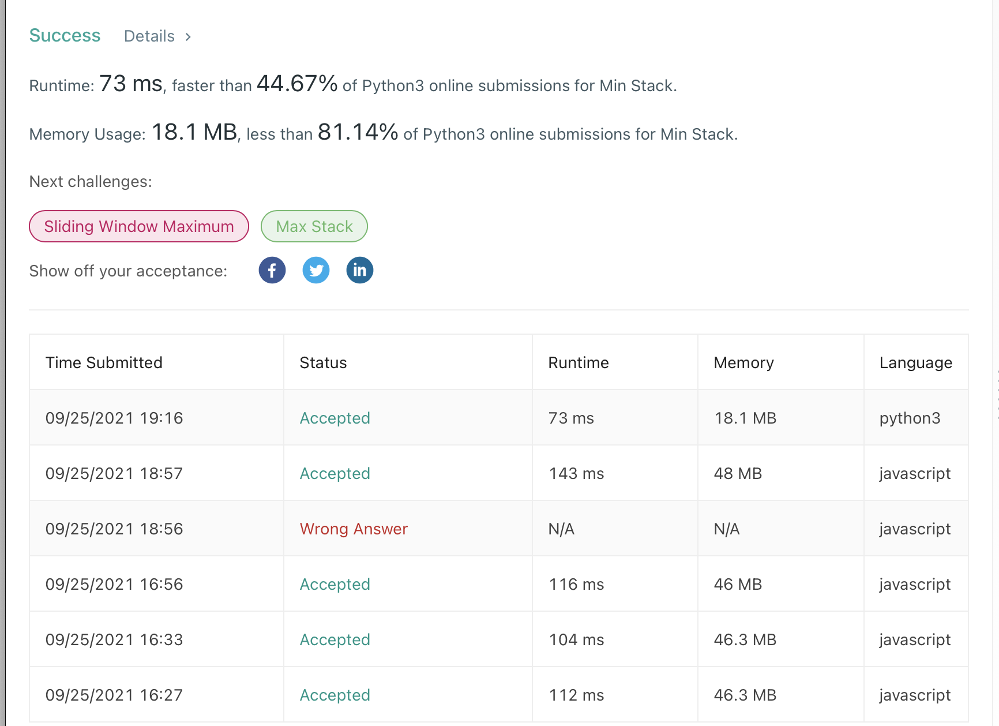

## 
Min Stack

#### 
📚 _LeetCode Problem #155 (**Level Easy**) 9/25/2021_ 

**_
By Daniel Adeyemi_**

---

## 
 🚩 _Description_:

##### **_This is solutions for Leet Code problem [# 155 "Min Stack"](https://leetcode.com/problems/min-stack/)._**

### 
 🤔 Problem description:

Design a stack that supports push, pop, top, and retrieving the minimum element in constant time.

Implement the MinStack class:

- **MinStack()** _initializes the stack object_.
- void **push(int val)** _pushes the element val onto the stack_.
- void **pop()** _removes the element on the top of the stack_.
- int **top()** _gets the top element of the stack_.
- int **getMin()** _retrieves the minimum element in the stack_.  
  

## 
 🚥 Tests

## 
 🛠️ _Technologies used:_

- Python 3.9
- JavaScript

## 
 🌟 _Improvement opportunities:_

- possible use of inbuilt methods like min or sort to make code more succinct.

## 
 📬 Contact Information

#### For any questions _[email author](mailto:adeyemidany+github@gmail.com?subject=[GitHub])_

## 
 📘 _License and copyright:_

> **_© Daniel Adeyemi, 2021_**  
> ⚖️ __
